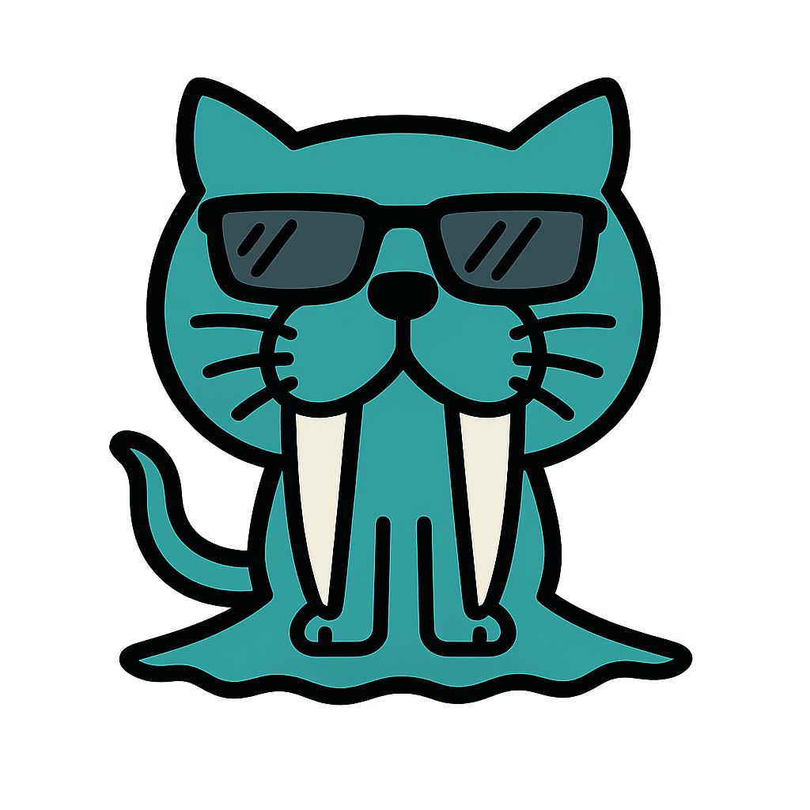

# WalGit: Decentralized, Self-Controlled Version Control

<p align="center">
  
</p>

## Overview

WalGit is a decentralized, user-controlled version control system built on Sui blockchain and Walrus's distributed storage technology. It empowers developers to maintain full sovereignty over their code while enjoying the benefits of cloud-based collaboration.

## Testing

To run the tests for the WalGit CLI:

```bash
cd WalGit-Backend
npm install
npm test
```

The test suite uses Jest and includes mocks for Sui and Walrus integration to ensure all CLI commands work properly without requiring actual blockchain interaction.

## Local Git Tree Simulation

You can test the basic local commit and push functionality without connecting to the network by using a simulated Git repository structure.

1.  Create a test directory and initialize a local WalGit repository:

    ```bash
    mkdir -p test-repo/.walgit
    cd test-repo
    ```

2.  Create some files and directories within `test-repo`:

    ```bash
    echo "This is the first file." > file1.txt
    mkdir src
    echo "console.log('Hello, WalGit!');" > src/main.js
    ```

3.  Run the local WalGit commit command from within the `test-repo` directory using `npx`:

    ```bash
    npx walgit commit -m "Initial local commit"
    ```

    This will create a simplified Git object structure (commit, tree, and blob files) within the `.walgit` directory.

4.  Run the local WalGit push command from within the `test-repo` directory using `npx`:

    ```bash
    npx walgit push
    ```

    This will simulate a push operation and confirm the latest local commit.

## Why WalGit?

> "Developers should not have to choose between the convenience of cloud-hosted version control and the sovereignty of their own code."

The increasing centralization of code hosting platforms like GitHub—now under Microsoft's control—raises concerns about:
- Data privacy
- Code ownership
- Unauthorized use of open source contributions to train proprietary AI models

WalGit addresses these challenges by leveraging Walrus's decentralized storage capabilities to provide a self-hosted, git-like version control system. With WalGit, developers own their repositories and manage their storage through a decentralized cloud, ensuring both autonomy and security.

## Key Features

### 🌐 Decentralized Storage
WalGit utilizes Walrus's distributed cloud storage, allowing users to host their code on infrastructure they control, rather than relying on a single centralized provider.

### 🔐 Self-Ownership and Control
Users retain full ownership of their repositories, including how and where their data is stored and who can access it.

### 📖 Open Source and Transparent
WalGit is fully open source, ensuring transparency and community-driven development. Anyone can audit, contribute to, or deploy the platform.

### 🛡️ End-to-End Encryption
Code is protected using Seal's encryption and native wallet-based encryption, providing robust security for sensitive projects and intellectual property.

### 💰 Affordable and Accessible
By leveraging Walrus's cost-effective and widely available storage, WalGit offers a scalable solution for individuals and teams without the high costs of traditional cloud services.

### 🔄 Familiar Git-Like Experience
WalGit maintains a workflow and interface similar to GitHub, making it easy for developers to transition without sacrificing usability or productivity.

## Technology Stack

- **Frontend**: React with TypeScript
- **Styling**: Tailwind CSS
- **Blockchain**: Sui Network
- **Storage**: Walrus Decentralized Storage
- **Build Tool**: Vite
- **Key Dependencies**:
  - @mysten/dapp-kit: Sui dApp development kit
  - @mysten/sui.js: Sui blockchain interaction
  - React Router: Client-side routing
  - TanStack Query: Data fetching and caching

## Project Structure

- **WalGit-frontend/**: React-based frontend interface
  - `src/`: Source code
  - `public/`: Static assets
  - `dist/`: Production build output
- **walrus-sites/**: Integration with Walrus Sites for storage
- **.github/workflows/**: CI/CD automation
  - `deploy.yml`: GitHub Pages deployment
- **smart-contracts/**: Sui Move contracts

## Getting Started

### Prerequisites
- Node.js v18+
- Sui wallet (Sui Wallet, Ethos Wallet, or other compatible wallets)
- Access to Walrus storage
- Git

### Installation
```bash
# Clone the repository and submodules
git clone https://github.com/Angleito/walgit.git --recursive
cd walgit

# Install root dependencies
npm install

# Install frontend dependencies
cd WalGit-frontend
npm install

# Start the development server
npm run dev
```

### Environment Setup
Create a `.env` file in the WalGit-frontend directory:
```env
VITE_NETWORK=devnet  # or testnet/mainnet
VITE_WALRUS_API_KEY=your_api_key
```

### Deployment
The project is automatically deployed to GitHub Pages using GitHub Actions whenever changes are pushed to the main branch. The deployment process includes:

1. Building the frontend application
2. Deploying to GitHub Pages
3. Generating Walrus Sites provenance data

Visit: [https://angleito.github.io/walgit/](https://angleito.github.io/walgit/)

## Development

### Available Scripts
- `npm run dev`: Start development server
- `npm run build`: Build for production
- `npm run preview`: Preview production build locally

### Code Style
- TypeScript for type safety
- ESLint for code linting
- Prettier for code formatting

## Contributing

We welcome contributions to WalGit! Please follow these steps:

1. Fork the repository
2. Create a feature branch (`git checkout -b feature/amazing-feature`)
3. Commit your changes (`git commit -m 'Add amazing feature'`)
4. Push to the branch (`git push origin feature/amazing-feature`)
5. Open a Pull Request

## License

This project is licensed under the MIT License - see the [LICENSE](LICENSE) file for details.

## Acknowledgements

- Built on [Sui](https://sui.io/) blockchain
- Utilizes Walrus decentralized storage technology
- Integrates with Walrus Sites for provenance and verification
- Inspired by the need for developer sovereignty in the age of AI and centralized control
