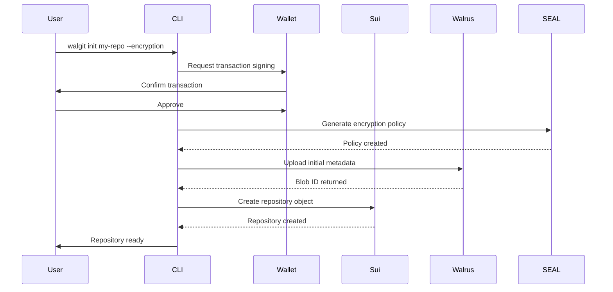
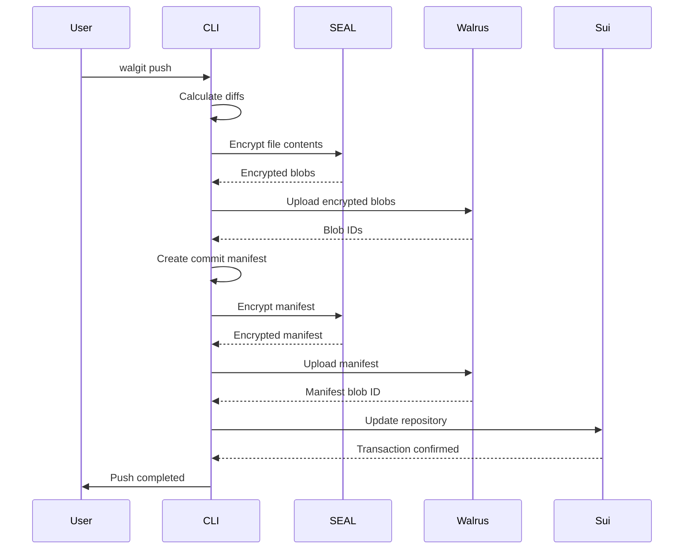
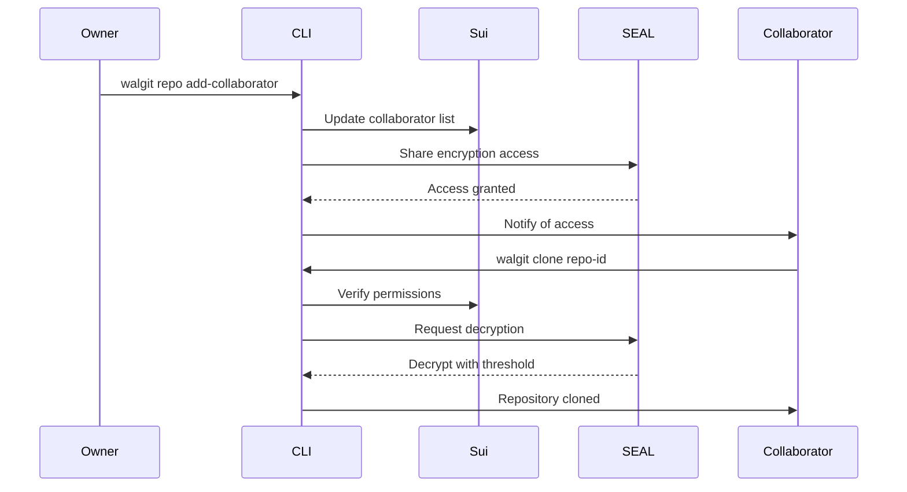

# WalGit Technical Architecture Documentation

## Table of Contents

1. [System Overview](#system-overview)
2. [Architecture Principles](#architecture-principles)
3. [Core Components](#core-components)
4. [Data Flow & Interactions](#data-flow--interactions)
5. [Smart Contract Architecture](#smart-contract-architecture)
6. [Storage Layer](#storage-layer)
7. [Security & Encryption](#security--encryption)
8. [Frontend Architecture](#frontend-architecture)
9. [Backend CLI Architecture](#backend-cli-architecture)
10. [Network & Communication](#network--communication)
11. [Performance & Scalability](#performance--scalability)
12. [Monitoring & Observability](#monitoring--observability)

## System Overview

WalGit is a decentralized version control system built on the Sui blockchain, leveraging Walrus storage for distributed file storage and SEAL for threshold encryption. The system provides Git-like functionality while ensuring user ownership, privacy, and resistance to censorship.

### High-Level Architecture

```
┌─────────────────┐    ┌─────────────────┐    ┌─────────────────┐
│   Frontend      │    │   Backend CLI   │    │ Smart Contracts │
│   (React/TS)    │◄───┤   (Node.js)     │◄───┤   (Move/Sui)    │
└─────────────────┘    └─────────────────┘    └─────────────────┘
         │                       │                       │
         │                       │                       │
         ▼                       ▼                       ▼
┌─────────────────┐    ┌─────────────────┐    ┌─────────────────┐
│   Wallet        │    │   Walrus        │    │   SEAL Network  │
│   Integration   │    │   Storage       │    │   Encryption    │
└─────────────────┘    └─────────────────┘    └─────────────────┘
```

### Key Technologies

- **Blockchain**: Sui Network (Move smart contracts)
- **Storage**: Walrus Decentralized Storage with RedStuff erasure coding
- **Encryption**: SEAL Threshold Encryption
- **Frontend**: React with TypeScript, Next.js App Router
- **CLI**: Node.js with ESM modules
- **Testing**: Jest, Playwright, Move test framework

## Architecture Principles

### 1. Decentralization First
- No single point of failure
- User data sovereignty
- Distributed storage and computation
- Blockchain-based metadata management

### 2. Progressive Decentralization
- Graceful degradation when services are unavailable
- Hybrid on-chain/off-chain data storage
- Fallback mechanisms for storage providers
- Local caching and offline capabilities

### 3. Security by Design
- End-to-end encryption with SEAL
- Threshold-based access control
- Immutable audit trails on blockchain
- Secure key management practices

### 4. Developer Experience
- Familiar Git-like interface
- Comprehensive CLI tooling
- Modern web UI with responsive design
- Extensive documentation and examples

### 5. Scalability & Performance
- Efficient blob storage with deduplication
- Parallel operations and batch processing
- Client-side optimization and caching
- Lazy loading and progressive enhancement

## Core Components

### 1. Smart Contract Layer (Sui Move)

#### Primary Contracts

**WalGit Core (`walgit.move`)**
```move
public struct WalGit has key {
    id: UID,
    version: String,
    admin: address
}
```
- Main entry point for system interactions
- Version management and system-wide configuration
- Administrative functions and upgrades

**Repository Management (`git_repository.move`)**
```move
public struct Repo has key, store {
    id: UID,
    name: String,
    description: String,
    owner: address,
    collaborators: Table<address, u8>,
    latest_commit_manifest_cid: String,
    encrypted_dek_cid: String,
    seal_policy_id: String,
    default_branch: String,
    created_at: u64,
    updated_at: u64
}
```
- Repository metadata and access control
- Collaborator management with role-based permissions
- Integration with SEAL encryption policies

**Storage Management (`storage.move`)**
```move
public struct StorageQuota has key {
    id: UID,
    owner: address,
    bytes_available: u64,
    bytes_used: u64,
    last_updated: u64
}
```
- Storage quota allocation and management
- Payment processing for additional storage
- Usage tracking and enforcement

### 2. Storage Layer Architecture

#### Walrus Integration
```typescript
interface WalrusClient {
  writeBlob(content: Buffer, options?: WriteOptions): Promise<BlobId>;
  readBlob(blobId: BlobId): Promise<Buffer>;
  deleteBlob(blobId: BlobId): Promise<boolean>;
  getBlobInfo(blobId: BlobId): Promise<BlobMetadata>;
}
```

**Features:**
- Chunked uploads for large files (up to 14GB)
- RedStuff erasure coding for redundancy
- Content deduplication and compression
- Parallel read/write operations

#### Storage Optimization
```typescript
interface StorageOptimizer {
  deduplicateBlobs(blobs: Blob[]): Promise<DedupResult>;
  compressContent(content: Buffer): Promise<Buffer>;
  createDeltaPatches(oldContent: Buffer, newContent: Buffer): Promise<Delta>;
  applyDeltaPatches(oldContent: Buffer, delta: Delta): Promise<Buffer>;
}
```

### 3. Encryption Layer (SEAL Integration)

#### Threshold Encryption
```typescript
interface SealClient {
  generateThresholdKey(options: ThresholdOptions): Promise<KeyPolicy>;
  encrypt(data: Buffer, publicKey: string, policy: AccessPolicy): Promise<EncryptedData>;
  decrypt(encryptedData: EncryptedData, keyShares: KeyShare[]): Promise<Buffer>;
  rotateKeys(policyId: string): Promise<KeyRotationResult>;
}
```

**Policy Management:**
```typescript
interface AccessPolicy {
  policyId: string;
  threshold: number;
  totalShares: number;
  accessList: AccessEntry[];
  rotationInterval: number;
}

interface AccessEntry {
  address: string;
  role: 'owner' | 'admin' | 'writer' | 'reader';
  shareIds: string[];
  grantedAt: string;
}
```

## Data Flow & Interactions

### 1. Repository Creation Flow



### 2. File Push Flow



### 3. Collaboration Flow



## Smart Contract Architecture

### 1. Contract Hierarchy

```
WalGit (Main Entry Point)
├── GitRepository (Repository Management)
├── GitCommitObject (Commit Data)
├── GitTreeObject (Directory Structure)
├── GitBlobObject (File Content References)
├── GitReference (Branch/Tag Management)
├── GitIndex (Staging Area)
├── GitMerge (Merge Operations)
├── GitCodeReview (Code Review System)
├── GitDiff (File Comparison)
└── Storage (Quota Management)
```

### 2. Access Control Model

```move
// Role-based permissions
const ROLE_READER: u8 = 1;    // Can read repository
const ROLE_WRITER: u8 = 2;    // Can read and write
const ROLE_ADMIN: u8 = 3;     // Can manage collaborators

// Capability-based access
public struct OwnerCap has key, store {
    id: UID,
    repo_id: ID
}

public struct WriteCap has key, store {
    id: UID,
    repo_id: ID
}
```

### 3. Event System

```move
// Repository events
public struct RepositoryCreated has copy, drop {
    repo_id: ID,
    owner: address,
    name: String,
    created_at: u64
}

public struct CollaboratorAdded has copy, drop {
    repo_id: ID,
    collaborator: address,
    role: u8,
    added_by: address
}

public struct CommitCreated has copy, drop {
    repo_id: ID,
    commit_id: ID,
    author: address,
    message: String,
    timestamp: u64
}
```

## Storage Layer

### 1. Blob Storage Architecture

```typescript
interface BlobManager {
  // Core operations
  storeBlob(content: Buffer, metadata: BlobMetadata): Promise<BlobId>;
  retrieveBlob(blobId: BlobId): Promise<Buffer>;
  deleteBlob(blobId: BlobId): Promise<void>;
  
  // Optimization
  deduplicateContent(content: Buffer): Promise<DedupResult>;
  compressBlob(blob: Buffer): Promise<CompressedBlob>;
  createDelta(oldBlob: Buffer, newBlob: Buffer): Promise<DeltaPatch>;
  
  // Metadata
  getBlobMetadata(blobId: BlobId): Promise<BlobMetadata>;
  listBlobs(prefix?: string): Promise<BlobId[]>;
}
```

### 2. Storage Providers

**Walrus Storage (Primary)**
- Decentralized storage with erasure coding
- High availability and durability
- Content-addressed storage
- Parallel upload/download

**Tusky Storage (Free Tier)**
- 5GB personal quota
- 50GB shared WalGit quota
- Automatic fallback when quota exceeded
- Cost-effective for open source projects

**Storage Abstraction Layer**
```typescript
interface StorageProvider {
  upload(content: Buffer, options: UploadOptions): Promise<string>;
  download(id: string): Promise<Buffer>;
  delete(id: string): Promise<void>;
  getQuota(): Promise<QuotaInfo>;
  getUsage(): Promise<UsageInfo>;
}
```

### 3. Caching Strategy

**Multi-Level Caching**
```typescript
interface CacheManager {
  // Memory cache (L1)
  memoryCache: LRUCache<string, Buffer>;
  
  // Disk cache (L2)
  diskCache: DiskCache;
  
  // Persistent cache (L3)
  persistentCache: PersistentCache;
  
  get(key: string): Promise<Buffer | null>;
  set(key: string, value: Buffer, ttl?: number): Promise<void>;
  invalidate(key: string): Promise<void>;
}
```

## Security & Encryption

### 1. SEAL Threshold Encryption

**Key Generation**
```typescript
interface ThresholdKeyGeneration {
  threshold: number;        // Minimum shares needed
  totalShares: number;      // Total shares created
  keyShares: KeyShare[];    // Distributed key shares
  publicKey: string;        // Public key for encryption
  policyId: string;         // Policy identifier
}
```

**Access Control**
```typescript
interface EncryptionPolicy {
  policyId: string;
  algorithm: 'threshold' | 'multi-sig';
  threshold: number;
  accessRules: AccessRule[];
  rotationSchedule: RotationPolicy;
  auditLog: AuditEntry[];
}
```

### 2. Key Management

**Key Rotation**
```typescript
interface KeyRotation {
  rotateKeys(policyId: string): Promise<RotationResult>;
  scheduleRotation(policyId: string, schedule: Schedule): Promise<void>;
  emergencyRotation(policyId: string, reason: string): Promise<void>;
}
```

**Recovery Mechanisms**
```typescript
interface KeyRecovery {
  generateRecoveryShares(policyId: string): Promise<RecoveryShare[]>;
  recoverFromShares(shares: RecoveryShare[]): Promise<RecoveryResult>;
  socialRecovery(guardians: Guardian[]): Promise<RecoveryResult>;
}
```

### 3. Security Audit Trail

```move
public struct SecurityEvent has copy, drop {
    event_type: String,        // "key_rotation", "access_granted", etc.
    actor: address,            // Who performed the action
    target: Option<address>,   // Who was affected (if applicable)
    resource_id: String,       // Repository or key ID
    timestamp: u64,            // When it happened
    metadata: String           // Additional event data
}
```

## Frontend Architecture

### 1. Application Structure

```
src/
├── app/                    # Next.js App Router
│   ├── layout.tsx         # Root layout
│   ├── page.tsx           # Landing page
│   ├── dashboard/         # Dashboard routes
│   ├── repositories/      # Repository management
│   └── settings/          # User settings
├── components/            # React components
│   ├── ui/               # Reusable UI components
│   ├── forms/            # Form components
│   ├── layout/           # Layout components
│   └── features/         # Feature-specific components
├── hooks/                # Custom React hooks
├── lib/                  # Utility functions
├── services/             # API services
└── types/                # TypeScript type definitions
```

### 2. State Management

**React Query for Server State**
```typescript
interface RepositoryQueries {
  useRepositories(): UseQueryResult<Repository[]>;
  useRepository(id: string): UseQueryResult<Repository>;
  useCreateRepository(): UseMutationResult<Repository, Error, CreateRepoData>;
  useUpdateRepository(): UseMutationResult<Repository, Error, UpdateRepoData>;
}
```

**Zustand for Client State**
```typescript
interface AppStore {
  // Wallet state
  wallet: WalletState;
  setWallet: (wallet: WalletState) => void;
  
  // UI state
  theme: 'light' | 'dark' | 'cyberpunk';
  setTheme: (theme: Theme) => void;
  
  // User preferences
  preferences: UserPreferences;
  updatePreferences: (updates: Partial<UserPreferences>) => void;
}
```

### 3. Component Architecture

**Atomic Design Pattern**
```
components/
├── atoms/              # Basic UI elements
│   ├── Button/
│   ├── Input/
│   └── Badge/
├── molecules/          # Simple combinations
│   ├── SearchBar/
│   ├── UserCard/
│   └── StatusIndicator/
├── organisms/          # Complex UI sections
│   ├── RepositoryList/
│   ├── NavigationBar/
│   └── CommitHistory/
└── templates/          # Page layouts
    ├── DashboardLayout/
    ├── RepositoryLayout/
    └── SettingsLayout/
```

## Backend CLI Architecture

### 1. Command Structure

```typescript
interface Command {
  name: string;
  description: string;
  options: CommandOption[];
  action: (args: string[], options: CommandOptions) => Promise<void>;
  subcommands?: Command[];
}
```

**Command Categories**
```
commands/
├── core/               # Basic Git operations
│   ├── init.js
│   ├── add.js
│   ├── commit.js
│   ├── push.js
│   └── pull.js
├── collaboration/      # Team features
│   ├── clone.js
│   ├── merge.js
│   └── pr.js
├── security/          # Encryption features
│   ├── encryption.js
│   ├── keys.js
│   └── access.js
└── management/        # Repository management
    ├── repo.js
    ├── storage.js
    └── config.js
```

### 2. Plugin Architecture

```typescript
interface Plugin {
  name: string;
  version: string;
  commands?: Command[];
  hooks?: PluginHooks;
  dependencies?: string[];
}

interface PluginHooks {
  preCommand?: (command: string, args: string[]) => Promise<void>;
  postCommand?: (command: string, result: any) => Promise<void>;
  onError?: (error: Error) => Promise<void>;
}
```

### 3. Configuration Management

```typescript
interface Config {
  // User settings
  user: {
    name: string;
    email: string;
    signingKey?: string;
  };
  
  // Network settings
  sui: {
    network: 'mainnet' | 'testnet' | 'devnet';
    rpc: string;
    gasPrice?: number;
  };
  
  // Storage settings
  storage: {
    provider: 'walrus' | 'tusky';
    endpoint: string;
    apiKey?: string;
    quota: string;
  };
  
  // Security settings
  encryption: {
    enabled: boolean;
    algorithm: string;
    keyRotationInterval: number;
  };
}
```

## Network & Communication

### 1. Sui Network Integration

**Transaction Management**
```typescript
interface TransactionManager {
  buildTransaction(operations: Operation[]): TransactionBlock;
  signTransaction(tx: TransactionBlock, keypair: Keypair): Promise<SignedTransaction>;
  executeTransaction(signedTx: SignedTransaction): Promise<TransactionResult>;
  waitForConfirmation(txId: string): Promise<TransactionReceipt>;
}
```

**Error Handling & Retries**
```typescript
interface NetworkResilience {
  retryWithBackoff<T>(
    operation: () => Promise<T>,
    options: RetryOptions
  ): Promise<T>;
  
  circuitBreaker<T>(
    operation: () => Promise<T>,
    breakerOptions: CircuitBreakerOptions
  ): Promise<T>;
  
  batchOperations<T>(
    operations: (() => Promise<T>)[],
    batchSize: number
  ): Promise<T[]>;
}
```

### 2. Real-time Communication

**WebSocket Integration**
```typescript
interface RealtimeManager {
  connect(): Promise<void>;
  subscribe(topic: string, handler: MessageHandler): void;
  unsubscribe(topic: string): void;
  publish(topic: string, message: any): void;
  disconnect(): void;
}
```

**Event Streaming**
```typescript
interface EventStream {
  onRepositoryUpdate(repoId: string, handler: UpdateHandler): void;
  onCollaboratorChange(repoId: string, handler: CollaboratorHandler): void;
  onCommitPush(repoId: string, handler: CommitHandler): void;
}
```

## Performance & Scalability

### 1. Optimization Strategies

**Content Deduplication**
```typescript
interface DedupManager {
  computeHash(content: Buffer): string;
  findDuplicates(hashes: string[]): Promise<DuplicateMap>;
  createReferences(duplicates: DuplicateMap): Promise<ReferenceMap>;
}
```

**Lazy Loading**
```typescript
interface LazyLoader {
  loadOnDemand<T>(loader: () => Promise<T>): Promise<T>;
  preloadContent(priorities: LoadPriority[]): Promise<void>;
  cacheResults<T>(key: string, loader: () => Promise<T>): Promise<T>;
}
```

### 2. Scalability Patterns

**Horizontal Scaling**
```typescript
interface ScalingManager {
  distributeLoad(requests: Request[]): Promise<Response[]>;
  balanceStorageProviders(): Promise<void>;
  optimizeNetworkRouting(): Promise<void>;
}
```

**Resource Management**
```typescript
interface ResourceManager {
  monitorUsage(): ResourceMetrics;
  scaleResources(demand: ScalingDemand): Promise<void>;
  optimizeAllocation(): Promise<OptimizationResult>;
}
```

## Monitoring & Observability

### 1. Metrics Collection

**System Metrics**
```typescript
interface MetricsCollector {
  // Performance metrics
  recordLatency(operation: string, duration: number): void;
  recordThroughput(operation: string, count: number): void;
  recordErrorRate(operation: string, errors: number): void;
  
  // Business metrics
  recordRepositoryCreation(): void;
  recordCollaboratorActivity(): void;
  recordStorageUsage(bytes: number): void;
}
```

**Custom Dashboards**
```typescript
interface Dashboard {
  systemHealth(): HealthMetrics;
  userActivity(): ActivityMetrics;
  storageUtilization(): StorageMetrics;
  networkPerformance(): NetworkMetrics;
}
```

### 2. Logging Strategy

**Structured Logging**
```typescript
interface Logger {
  debug(message: string, context?: object): void;
  info(message: string, context?: object): void;
  warn(message: string, context?: object): void;
  error(message: string, error?: Error, context?: object): void;
  audit(event: AuditEvent): void;
}
```

**Log Aggregation**
```typescript
interface LogAggregator {
  collectLogs(sources: LogSource[]): Promise<LogEntry[]>;
  filterLogs(criteria: FilterCriteria): Promise<LogEntry[]>;
  exportLogs(format: ExportFormat): Promise<string>;
}
```

### 3. Alerting & Notifications

**Alert Configuration**
```typescript
interface AlertManager {
  defineAlert(rule: AlertRule): void;
  triggerAlert(alert: Alert): Promise<void>;
  acknowledgeAlert(alertId: string): Promise<void>;
  escalateAlert(alertId: string): Promise<void>;
}
```

## Deployment & Operations

### 1. Environment Configuration

**Development Environment**
```yaml
sui:
  network: devnet
  rpc: https://fullnode.devnet.sui.io:443
storage:
  provider: mock
  quota: unlimited
encryption:
  enabled: false
logging:
  level: debug
```

**Production Environment**
```yaml
sui:
  network: mainnet
  rpc: https://fullnode.mainnet.sui.io:443
storage:
  provider: walrus
  quota: 100GB
encryption:
  enabled: true
  keyRotation: 90d
logging:
  level: info
  aggregation: enabled
```

### 2. Continuous Deployment

**Pipeline Stages**
```yaml
stages:
  - test:
      - unit-tests
      - integration-tests
      - security-scan
  - build:
      - compile-contracts
      - build-frontend
      - package-cli
  - deploy:
      - deploy-contracts
      - deploy-frontend
      - publish-cli
  - monitor:
      - health-checks
      - performance-tests
      - user-acceptance
```

This technical architecture provides a comprehensive foundation for building, maintaining, and scaling the WalGit decentralized version control system. The modular design ensures flexibility while maintaining security and performance standards.